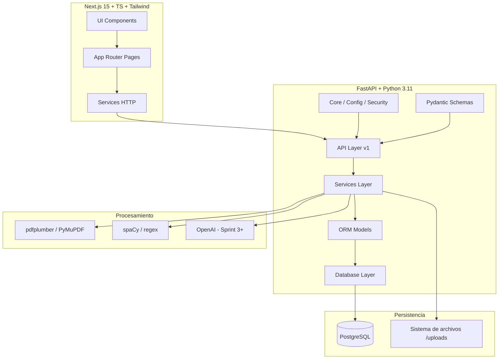
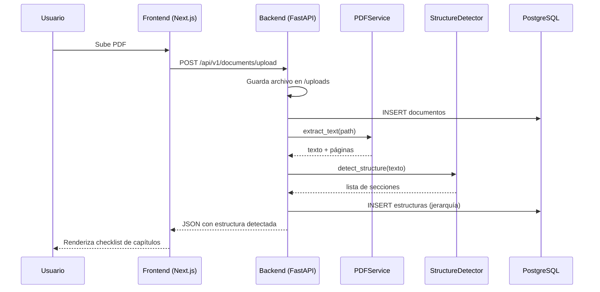

# Arquitectura del Sistema — Tesis Assistant

## 1. Visión general

Sistema modular cliente-servidor para analizar y generar tesis académicas.
El **MVP** se centra en **extraer la estructura** de una guía/tesis modelo en PDF.

```
┌──────────────┐    HTTPS/JSON     ┌────────────────┐    SQL     ┌──────────────┐
│   Next.js    │ ────────────────► │   FastAPI      │ ─────────► │ PostgreSQL   │
│  (Frontend)  │ ◄──────────────── │   (Backend)    │ ◄───────── │              │
└──────────────┘                   └────────┬───────┘            └──────────────┘
                                            │
                                            ▼
                                   ┌────────────────┐
                                   │ Servicios IA / │
                                   │ pdfplumber /   │
                                   │ spaCy / OpenAI │
                                   └────────────────┘
```

## 2. Diagrama de módulos



## 3. Flujo MVP



## 4. Capas (Clean Architecture light)

| Capa            | Responsabilidad                                    |
|-----------------|----------------------------------------------------|
| `api/`          | Rutas HTTP, validación de entrada/salida           |
| `schemas/`      | DTOs Pydantic (in/out)                             |
| `services/`     | Lógica de negocio (PDF, estructura, IA)            |
| `models/`       | Entidades SQLAlchemy                               |
| `database/`     | Sesión, engine, migraciones                        |
| `core/`         | Config, logging, seguridad                         |
| `utils/`        | Helpers transversales                              |

## 5. Roadmap por Sprints

- **Sprint 1** ✅ Subida PDF + detección estructural por regex.
- **Sprint 2** ⏳ Conversión estructura → plantilla JSON reutilizable.
- **Sprint 3** ⏳ Asistente conversacional (preguntas guiadas).
- **Sprint 4** ⏳ Generación automática de Resumen, Introducción, Objetivos (OpenAI).
- **Sprint 5** ⏳ Exportación a `.docx` con formato UCV.
